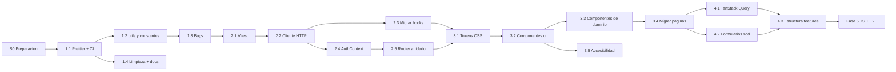

# Plan de implementacion

Plan para ejecutar las mejoras descritas en [PUNTOS_DE_MEJORA.md](PUNTOS_DE_MEJORA.md),
siguiendo el orden de sprints sugerido ahi. Cada sprint se divide en **PRs pequenos e
independientes**, con tareas, archivos afectados y criterios de aceptacion.

Las casillas `[ ]` sirven para llevar el avance directamente en este archivo.

## Indice

- [Reglas generales](#reglas-generales)
- [Mapa de dependencias](#mapa-de-dependencias)
- [Sprint 0 — Preparacion](#sprint-0--preparacion)
- [Sprint 1 — Estabilizar](#sprint-1--estabilizar)
- [Sprint 2 — Base tecnica](#sprint-2--base-tecnica)
- [Sprint 3 — UI consistente](#sprint-3--ui-consistente)
- [Sprint 4 — Escalar](#sprint-4--escalar)
- [Fase 5 — Despues](#fase-5--despues)
- [Dependencias con el backend](#dependencias-con-el-backend)
- [Riesgos y mitigacion](#riesgos-y-mitigacion)
- [Checklist de pruebas manuales](#checklist-de-pruebas-manuales)
- [Resumen de esfuerzo](#resumen-de-esfuerzo)

---

## Reglas generales

1. **Flujo de ramas:** cada PR sale de `develop` y se abre contra `develop`. Al cerrar cada
   sprint, `develop` se promueve a `main` y se crea un tag (`v0.2.0`, `v0.3.0`, ...).
2. **Un PR = un objetivo.** No mezclar cambios de formato, movimientos de archivos y cambios
   de logica en el mismo PR. Tamano objetivo: menos de 400 lineas de diff (excepto los PRs
   puramente mecanicos, que se marcan como tales).
3. **El codigo nuevo nace en su ubicacion final.** Aunque la reestructura por features es del
   Sprint 4, los modulos nuevos (`src/api/`, `src/utils/`, `src/constants/`,
   `src/components/ui/`, `src/features/auth/`) se crean desde el inicio donde van a quedar.
   Asi en el Sprint 4 solo se mueven las paginas y hooks antiguos, y nada se mueve dos veces.
4. **Migracion gradual (strangler):** al introducir una capa nueva (cliente HTTP, TanStack
   Query, componentes `ui/`), los hooks y paginas se migran por dominio en PRs separados,
   manteniendo su API publica mientras dure la transicion.
5. **Definition of Done de cada PR:**
   - [ ] `npm run lint` sin errores (y sin warnings nuevos).
   - [ ] `npm run build` exitoso.
   - [ ] `npm test` en verde (a partir del Sprint 2).
   - [ ] Checklist de pruebas manuales ejecutado en las pantallas afectadas.
   - [ ] Capturas antes/despues en el PR si hay cambios visuales.
   - [ ] README actualizado si cambia estructura, scripts o variables de entorno.
   - [ ] Commits en formato Conventional Commits.

---

## Mapa de dependencias



---

## Sprint 0 — Preparacion

**Objetivo:** partir de una base limpia y con decisiones acordadas.
**Esfuerzo estimado:** 0.5 dia.

- [ ] Cerrar el PR de `refactor/vocabulario-experiencia-educativa` y sincronizar `develop`.
      _Pendiente: requiere revisar y fusionar el PR en GitHub._
- [ ] Resolver el archivo `PLAN_RECONSTRUCCION.md` que aparece como borrado en el working
      _Pendiente: el borrado ya estaba en la copia local; lo decide el autor del archivo._
      tree (confirmar el borrado en un commit o restaurarlo).
- [ ] Crear el tag `v0.1.0` sobre `main` como punto de referencia antes del refactor.
      _Pendiente: la decision de publicar versiones corresponde al equipo._
- [x] Tomar capturas de todas las pantallas (escritorio y movil) para comparar despues de los
      cambios visuales del Sprint 3. Guardarlas fuera del repo o en `docs/capturas/`.
- [x] Acordar y documentar en el README las **decisiones de convencion**:
  - Idioma del codigo: sugerido **nombres de dominio en espanol** (`tutoria`, `horario`,
    `inscripcion`) y **terminos tecnicos en ingles** (`isLoading`, `onSubmit`, `refetch`).
  - Textos visibles al usuario **con acentos y ortografia correcta**.
  - Exports: **named exports** para hooks, utils y componentes; `default` solo en paginas
    (necesario para `lazy`).
  - Extension: `.js` para archivos sin JSX, `.jsx` para componentes.
- [x] Levantar con el equipo de backend la lista de
      [dependencias con el backend](#dependencias-con-el-backend).

---

## Sprint 1 — Estabilizar

**Objetivo:** corregir los bugs conocidos, eliminar duplicacion trivial y automatizar la
calidad basica.
**Esfuerzo estimado:** 4–5 dias.
**Entregable:** `v0.2.0`.

### PR 1.1 — `chore/prettier-husky-ci`

Va primero para que todos los PRs siguientes tengan diffs limpios.

- [x] Instalar `prettier` y `eslint-config-prettier`.
- [x] Crear `.prettierrc` con el estilo actual del codigo (sin punto y coma, comillas simples,
      `trailingComma: 'all'`, `printWidth: 100`) y `.prettierignore` (`dist`, `coverage`).
- [x] Agregar `eslint-config-prettier` al final de `eslint.config.js`.
- [x] Scripts en `package.json`: `"format": "prettier --write ."`,
      `"format:check": "prettier --check ."`.
- [x] Formatear todo el proyecto en **un commit aislado** y registrar su hash en
      `.git-blame-ignore-revs` para no ensuciar `git blame`.
- [x] Instalar `husky` + `lint-staged`: en `pre-commit` correr `eslint --fix` y `prettier --write`
      sobre los archivos en stage.
- [x] Instalar `@commitlint/cli` + `@commitlint/config-conventional` con hook `commit-msg`.
- [x] Crear `.github/workflows/ci.yml`: en `pull_request` hacia `develop`/`main` ejecutar
      `npm ci`, `npm run lint`, `npm run format:check`, `npm run build` (Node 22).
- [x] Crear `.github/dependabot.yml` (npm semanal, agrupando minors/patches).
- [x] Crear `.github/pull_request_template.md` con el Definition of Done.
- [x] `package.json`: `"name": "sistema-tutorias-front"`, `"version": "0.1.0"`,
      `"engines": { "node": ">=20.19" }`; agregar `.nvmrc` con `22`.

**Criterios de aceptacion:** el CI corre en el PR y queda en verde; un commit con mensaje
invalido es rechazado localmente.

### PR 1.2 — `refactor/utils-y-constantes`

- [x] `src/utils/formatters.js`:
  - `formatFecha(fecha, { variant: 'corta' | 'larga' })` (reemplaza las 5 copias; `corta` usa
    `weekday/month: 'short'`, `larga` usa `'long'`).
  - `formatHora(hora)`, `formatRangoHora(inicio, fin)`.
  - `formatHorario(h)` → `"Lunes · 10:00 - 12:00"` (usado en 3 selects/listas).
  - `formatTema(tema)` → reemplaza `tema.tema || tema.nombre || String(tema)`.
  - `getIniciales(texto)` (hoy en `Sidebar.jsx` y variantes en `Comentarios` e inscritos).
- [x] `src/utils/fechas.js`: `hoyLocalISO()`, `minutosHasta(fecha, hora)`,
      `yaInicio(fecha, hora)`, `formatTiempoRestante(minutos)`.
- [x] `src/constants/tutoria.js`: `ESTADOS_TUTORIA`, `ESTADO_CLASS`, `MAX_CARACTERES_TEMA`,
      `MAX_TEMAS`, `MIN_MINUTOS_CANCELACION`.
- [x] `src/constants/espacios.js`: `EDIFICIOS`, `AULAS`.
- [x] `src/constants/roles.js`: `ROLES`, `HOME_POR_ROL` (`tutor` y `admin` → `/tutor/home`,
      `tutorado` → `/tutorado/home`).
- [x] Reemplazar las copias locales en: `pages/Tutor/Home.jsx`,
      `pages/Tutor/TutoriaDetalle/TutoriaDetalle.jsx`, `pages/Tutorado/Home.jsx`,
      `pages/Tutorado/MisTutorias.jsx`, `pages/Tutorado/TutoriaDetalle.jsx`,
      `pages/Tutor/CrearTutoria/FormCrearTutoria.jsx`,
      `pages/Tutor/AgregarHorario/AgregarHorarioForm.jsx`, `components/Tutor/TemasInput.jsx`,
      `components/layout/Sidebar.jsx`.

**Criterios de aceptacion:** `grep -rn "const formatFecha" src` devuelve 1 resultado; ninguna
pantalla cambia visualmente.

### PR 1.3 — `fix/bugs-detectados`

Si el diff crece, dividir en un PR por bug.

- [x] **Rol admin:** `AppRouter` usa `HOME_POR_ROL` para `/`; las rutas de tutor permiten
      `['tutor', 'admin']`; `useAutentificacion.login` navega con `HOME_POR_ROL[rol] ?? '/login'`.
- [x] **Fecha en UTC:** usar `hoyLocalISO()` en `FormCrearTutoria.jsx` y en la edicion de
      `TutoriaDetalle.jsx` (tutor).
- [x] **Exito detectado por texto:** `useTutoriaDetalleTutorado` devuelve `{ ok, message }` en
      `inscribirse` y `cancelarInscripcion`; la pagina usa `res.ok`.
- [x] **Horario perdido al editar:** al pulsar "Editar tutoria", precargar `idHorario`,
      `edificio`, `aula` y `fecha` dentro del `onClick` y eliminar el `useEffect` (resuelve 1
      warning de lint). Si el DTO de tutoria no trae `idHorario`, buscar en `horarios` el que
      coincida en `horaInicio`/`horaFin` y levantar issue al backend para exponerlo.
- [x] **Validacion numerica:** validar `!valor` antes de `Number(valor)` en edicion y creacion.
- [x] **JSON vacio:** `response.json().catch(() => null)` en `useCrearTutoria.jsx` y
      `useTutoriasExplorar.jsx`.
- [x] Eliminar el `console.log` de `useTutoriaDetalleTutorado.jsx`.
- [x] `useCrearTutoria` expone `reset()`; `CrearTutoria.handleLimpiar` lo usa.
- [x] `logout` deja de borrar la clave `correo` (nunca se guarda).
- [x] Confirmar con backend si se notifica a los inscritos al cancelar; si no, quitar la frase
      "Los inscritos seran notificados".

**Criterios de aceptacion:** un usuario `admin` entra al panel de tutor; a las 19:00 hora local
se puede crear una tutoria para el mismo dia; un error del backend al inscribirse se muestra
en rojo; editar una tutoria sin tocar el horario guarda correctamente.

### PR 1.4 — `chore/limpieza-y-docs`

- [x] Borrar archivos sin uso (verificado con grep): `src/App.css`, `src/assets/react.svg`,
      `src/assets/vite.svg`, `src/assets/hero.png`, `public/icons.svg`.
- [x] Cargar la tipografia: `npm i @fontsource-variable/montserrat` e importarla en `main.jsx`.
- [ ] `index.html`: `meta description`, `og:title`, `og:description`, `apple-touch-icon`.
      _Pendiente: `apple-touch-icon` requiere un PNG de 180x180 que aun no existe._
- [x] README: reemplazar la seccion de estructura (quitar `Header.jsx`/`HeaderTR.jsx`, agregar
      `layout/`, `utils/`, `constants/`), actualizar "Interfaz" (sidebar), documentar los
      scripts nuevos y las convenciones del Sprint 0.
- [x] Crear `CHANGELOG.md` (formato Keep a Changelog) y `CONTRIBUTING.md` (ramas, commits,
      Definition of Done, como correr el proyecto).

**Cierre del Sprint 1:** merge `develop` → `main`, tag `v0.2.0`, redeploy en Render y
checklist manual completo en produccion.

---

## Sprint 2 — Base tecnica

**Objetivo:** capa HTTP unica, sesion robusta, router moderno y primeras pruebas.
**Esfuerzo estimado:** 6–8 dias.
**Entregable:** `v0.3.0`.

### PR 2.1 — `test/setup-vitest`

- [x] Instalar `vitest`, `jsdom`, `@testing-library/react`, `@testing-library/jest-dom`,
      `@testing-library/user-event`, `@vitest/coverage-v8`, `msw`.
- [x] Configurar `test` en `vite.config.js` (`environment: 'jsdom'`, `setupFiles`,
      `css: false`) y crear `src/test/setup.js`.
- [x] Helper `src/test/render.jsx` que envuelve con `MemoryRouter` (y despues con los
      providers de auth y query).
- [x] Scripts: `"test": "vitest"`, `"test:run": "vitest run"`,
      `"test:coverage": "vitest run --coverage"`.
- [x] Pruebas de `utils/formatters.js` y `utils/fechas.js` usando `vi.useFakeTimers()` y
      `TZ=America/Mexico_City` para cubrir el caso de la fecha UTC.
- [x] Agregar `npm run test:run` al CI.

**Criterios de aceptacion:** cobertura de `utils/` ≥ 90 %; CI ejecuta las pruebas.

### PR 2.2 — `refactor/api-client`

- [x] `src/api/client.js`: `request()`, `api.get/post/put/patch/delete`, clase `ApiError`
      (`message`, `status`, `data`), manejo de red caida, cuerpo vacio y `success: false`.
- [x] Inyeccion de dependencias para evitar acoplar el cliente a la sesion:
      `configureApi({ getToken, onUnauthorized })`.
- [x] Timeout con `AbortController` (15 s) y soporte de `signal` externo.
- [x] Servicios por recurso: `src/api/auth.js`, `tutorias.js`, `horarios.js`, `materias.js`,
      `temas.js`, `asistencia.js`, `comentarios.js`.
- [x] `src/api/mappers.js`: `mapHorario`, `mapTutoria`, `mapInscripcion`, `mapTema`,
      `mapComentario` con todos los fallbacks de ids que hoy estan dispersos.
- [x] Pruebas con MSW: respuesta ok, 400 con `message`, 401 dispara `onUnauthorized`, 500 sin
      cuerpo, red caida, timeout. Pruebas unitarias de cada mapper.

**Criterios de aceptacion:** el cliente y los mappers tienen pruebas; todavia no se modifica
ningun hook (PR sin cambios visibles).

### PR 2.3 — `refactor/hooks-usan-api` (3 PRs, uno por dominio)

Cada hook conserva su API publica; las paginas no cambian.

- [x] **2.3a Horarios y creacion:** `useHorarios`, `useCrearTutoria` (usa `horariosApi`,
      `materiasApi`, `tutoriasApi`).
- [x] **2.3b Tutor:** `useMisTutorias`, `useTutoriaDetalleTutor`.
- [x] **2.3c Tutorado y comentarios:** `useTutoriasExplorar`, `useTutoriasTutorado`,
      `useTutoriaDetalleTutorado`, `useComentarios`. `MisTutorias.jsx` usa `mapInscripcion`
      en lugar de su `normalizar` local.
- [x] Contrato uniforme en todas las mutaciones: `Promise<{ ok, message, data? }>`.
- [x] Cancelar peticiones al desmontar o al cambiar `:id` con `AbortController`.

**Criterios de aceptacion:** `grep -rn "BASE_URL\|getAuthHeaders" src/hooks` sin resultados;
checklist manual completo sin regresiones.

> Implementado con un helper interno `useRecurso` (carga, cancelacion, `recargar` y `refrescar` sin parpadeo) que se reemplaza por TanStack Query en el PR 4.1.

### PR 2.4 — `feat/auth-context`

- [x] `src/features/auth/storage.js`: `STORAGE_KEYS` y funciones `leerSesion`,
      `guardarSesion`, `limpiarSesion`.
- [x] `src/features/auth/jwt.js`: `decodificarToken`, `tokenExpirado(token, margenSeg = 30)`.
- [x] `src/features/auth/AuthContext.jsx`: `AuthProvider` con estado
      `{ token, rol, matricula, nombre }`, `isAuthenticated`, `login`, `registro`, `logout`,
      `actualizarNombre`. Escucha el evento `storage` para sincronizar pestanas.
- [x] `useAuth()` reemplaza a `useAutentificacion`; `login`/`registro` devuelven
      `{ ok, message }` en vez de recibir `setError`.
- [x] Al montar el provider, llamar `configureApi({ getToken, onUnauthorized })`;
      `onUnauthorized` limpia sesion y navega a `/login` con `state: { expired: true }`.
- [x] Al cargar la app, si el token esta expirado, cerrar sesion antes de renderizar rutas.
- [x] `LogIn` muestra "Tu sesion expiro, vuelve a iniciar sesion" cuando aplica y redirige a
      `location.state.from` tras un login exitoso.
- [x] Eliminar `src/utils/sesion.js` y todos los `localStorage.getItem('token'|'rol'|...)`
      fuera de `storage.js` (`AppRouter`, `PrivateRoute`, `Comentarios`, `AppLayout`,
      `Tutor/Home`).
- [x] Pruebas: login ok/error, token expirado al cargar, 401 en una peticion, redireccion a
      `from`.

**Criterios de aceptacion:** `grep -rn "localStorage" src` solo aparece en
`features/auth/storage.js` y en la preferencia del sidebar; con un token vencido el usuario
llega a `/login` con el aviso.

> El contexto quedo dividido en `AuthContext.js` (contexto y `useAuth`) y `AuthProvider.jsx` por la regla de Fast Refresh. Al cerrar sesion no se navega: `RequireRole` redirige a `/login` y solo recuerda la pagina si el cierre no fue voluntario (evita competir con la carga diferida de la pagina de login).

### PR 2.5 — `refactor/router-anidado`

- [x] Migrar a `createBrowserRouter` + `RouterProvider` en `src/app/router.jsx`.
- [x] `src/constants/routes.js` con todas las rutas y helpers
      (`ROUTES.tutor.detalle(id)`).
- [x] `RequireRole` con `<Outlet />` (reemplaza `PrivateRoute`).
- [x] `AppLayout` como layout route con `<Outlet />`; las paginas dejan de envolverse en
      `<AppLayout>` (el `className` por pagina pasa al contenedor raiz de cada pagina).
- [x] Nuevas URLs y redirecciones desde las antiguas:

  | Antes                       | Despues                   |
  | --------------------------- | ------------------------- |
  | `/tutor/crear`              | `/tutor/tutorias/nueva`   |
  | `/tutor/agregar-horario`    | `/tutor/horarios`         |
  | `/tutor/tutoria/:id`        | `/tutor/tutorias/:id`     |
  | `/tutorado/infoTutoria/:id` | `/tutorado/tutorias/:id`  |
  | `/tutorado/tutorias`        | `/tutorado/inscripciones` |

- [x] `lazy` por ruta y `HydrateFallback`/`Suspense` con un loader de pagina.
- [x] `NotFoundPage` para `*` y `errorElement` con una pagina de error amigable
      (boton "Reintentar" y "Ir al inicio").
- [x] Hook `useDocumentTitle(titulo)` en cada pagina (`"Mis tutorias · Sistema de Tutorias"`).
- [x] Actualizar la tabla de rutas del README y el menu de `AppLayout`.
- [x] Pruebas: acceso por rol, redireccion de URLs antiguas, 404.

**Criterios de aceptacion:** `npm run build` genera un chunk por pagina; recargar cualquier URL
en Render funciona; las URLs antiguas redirigen.

> El titulo del documento se define una sola vez con `handle.titulo` en cada ruta (tambien lo usa la barra superior movil) en lugar de un hook por pagina. Al separar las paginas en chunks aparecio una dependencia oculta de CSS (Registro usaba `Login_respon.css` sin importarlo); se corrigio y se detecto con la comparacion de capturas.

**Cierre del Sprint 2:** tag `v0.3.0` y redeploy.

---

## Sprint 3 — UI consistente

**Objetivo:** sistema de diseno propio, componentes reutilizables y accesibilidad.
**Esfuerzo estimado:** 8–10 dias.
**Entregable:** `v0.4.0`.

### PR 3.1 — `style/design-tokens` (mecanico)

- [x] `src/styles/tokens.css`: colores (primario, texto, muted, bordes, fondos, exito, alerta,
      peligro), tipografia, espaciado, radios, sombras, z-index, duraciones y breakpoints
      documentados en comentarios.
- [x] `src/styles/animations.css`: `fade-in`, `shimmer`, `spin`, `pulse` (reemplazan los 28
      `@keyframes` actuales) y regla global de `prefers-reduced-motion`.
- [x] `src/styles/global.css` (renombre de `index.css`) importando tokens y animaciones.
- [x] Reemplazar hex por `var(--...)` en todos los CSS, **un commit por carpeta** para facilitar
      la revision.
- [x] Oscurecer el gris de texto secundario (`#8a93a3`) hasta cumplir contraste 4.5:1.
- [x] Unir los CSS responsive (`Login_respon.css`, `Registro_respon.css`,
      `agregarHorarioR.css`, `crearTutoriaR.css`) dentro de su archivo principal.

**Criterios de aceptacion:** `grep -rEo "#[0-9a-fA-F]{6}" src --include=*.css` solo devuelve
resultados en `tokens.css`; comparacion con capturas del Sprint 0 sin diferencias salvo el
ajuste de contraste.

> Verificado con capturas antes/despues: la diferencia maxima fue 0.17 % (solo el gris de apoyo).

### PR 3.2 — `feat/componentes-ui`

Todos con **CSS Modules** (`Button.module.css`) y exportados desde `src/components/ui/index.js`.

- [x] `Button` (variantes `primary | secondary | ghost | danger`, tamanos, `loading`,
      `fullWidth`, soporte `as={Link}`).
- [x] `Card`, `Badge`, `Chip` (con boton de quitar opcional).
- [x] `Input`, `Select`, `Textarea`, `FormField` (label, ayuda, error, `aria-describedby`,
      `aria-invalid`), `RadioGroup` basado en `<input type="radio">`.
- [x] `Alert` (`role="alert"` para error, `aria-live="polite"` para exito/info).
- [x] `Skeleton`, `Spinner`, `EmptyState`.
- [x] `Modal` sobre `<dialog>` nativo (foco inicial, Escape, retorno del foco) y
      `ConfirmDialog`.
- [x] Iconos: agregar a `components/layout/icons.jsx` (o adoptar `lucide-react`) los de
      calendario, reloj, edificio, puerta y busqueda para reemplazar emojis.
- [x] Instalar `eslint-plugin-jsx-a11y` (config `recommended`).
- [x] Pruebas: `Button` (loading deshabilita), `Modal` (Escape y foco), `Alert` (roles),
      `RadioGroup` (flechas).

> Se uso `eslint-plugin-jsx-a11y-x` (fork mantenido) porque `eslint-plugin-jsx-a11y` aun no admite ESLint 10. `Modal` atiende Escape en `keydown` ademas del evento `cancel`, que no todos los navegadores disparan igual.

### PR 3.3 — `refactor/componentes-de-dominio`

- [x] `EstadoBadge` (usa `ESTADO_CLASS`).
- [x] `TutoriaCard` con `variant="tutor" | "explorar" | "inscripcion"` (reemplaza las 3
      tarjetas).
- [x] `TutoriaInfoGrid` (fecha, horario, edificio, aula con iconos SVG).
- [x] `TemasInput` unificado con prop `compact` (reemplaza `TemaQuickInput`).
- [x] `InscritosList`, `AccionesTutoriaCard`, `EditarTutoriaForm`.
- [x] `AuthLayout` (panel de marca compartido por Login y Registro).
- [x] Mover `Comentarios` a `src/features/comentarios/`.

> Se agregaron ademas componentes compartidos por los dos detalles (DetalleTutoriaLayout, EncabezadoTutoria, SeccionTutoria, ListaTemas) y `PanelInscripcion` para el tutorado.

### PR 3.4 — `refactor/paginas-con-ui` (3 PRs)

- [x] **3.4a Auth:** `LogIn`, `Registro` sobre `AuthLayout` + componentes `ui/`.
- [x] **3.4b Tutor:** `Home`, `CrearTutoria`, `AgregarHorario`, `TutoriaDetalle`
      (objetivo: < 150 lineas).
- [x] **3.4c Tutorado:** `Home`, `MisTutorias`, `TutoriaDetalle`.
- [x] Borrar los estilos por pagina que queden sin uso y quitar `style={{...}}` inline.
- [x] Quitar de la UI el aviso tecnico del issue #8 del backend (dejarlo en un
      `console.warn` solo en desarrollo, si aun aplica).

**Criterios de aceptacion:** CSS total de `src/` reducido al menos 40 % (hoy ~5,800 lineas);
ningun archivo de pagina supera 200 lineas.

> CSS: 5,800 -> 3,004 lineas (-48 %). Paginas: ninguna supera 180 lineas; el detalle del tutor bajo de 571 a 172 (la meta de 150 quedo cerca). Al separar las paginas en chunks aparecio una dependencia oculta de CSS entre Registro y Login, corregida en el PR 2.5.

### PR 3.5 — `a11y/accesibilidad-y-textos`

- [x] Reemplazar `VentanaEmerjente` por `Modal` y borrar el componente.
- [x] Feedback y errores con `Alert`; contenedores en carga con `aria-busy`.
- [x] Selector de rol (Registro) y de dia (Horarios) con `RadioGroup`.
- [x] Revisar el nombre accesible de las tarjetas-enlace.
- [x] **Ortografia:** corregir acentos en todos los textos visibles (Tutorías, Contraseña,
      Matrícula, Sesión, Día, Miércoles...). Mantener sin acento los valores que se envian al
      backend (p. ej. `dia`) salvo que el backend lo acepte.
- [x] Revision con Lighthouse y axe DevTools en cada pantalla: accesibilidad ≥ 95.

> La auditoria se hizo con axe-core (mismo motor que axe DevTools y que la seccion de accesibilidad de Lighthouse) sobre las 10 pantallas: 0 hallazgos con las reglas WCAG 2.1 A/AA y de buenas practicas. Ademas se corrigio el contraste del verde de las acciones principales (2.9:1 -> 4.7:1).

**Cierre del Sprint 3:** comparar capturas con las del Sprint 0, tag `v0.4.0` y redeploy.

---

## Sprint 4 — Escalar

**Objetivo:** estado de servidor con cache, formularios declarativos y estructura final.
**Esfuerzo estimado:** 8–10 dias.
**Entregable:** `v1.0.0`.

### PR 4.1 — `feat/tanstack-query` (2–3 PRs)

- [ ] Instalar `@tanstack/react-query` y `@tanstack/react-query-devtools` (solo dev).
- [ ] `src/app/providers.jsx` con `QueryClientProvider` (`staleTime: 30s`, `retry: 1`, sin
      reintento en 4xx).
- [ ] `src/api/queryKeys.js` (fabrica de keys: `tutoriaKeys.all`, `.mias()`, `.detalle(id)`...).
- [ ] Queries: `useMisTutorias`, `useTutoriasDisponibles`, `useInscripciones`, `useHorarios`,
      `useMaterias`, `useTutoria(id)`, `useInscritos(id)`, `useComentarios(id)`.
- [ ] Mutaciones con invalidacion: crear/editar/cancelar/completar tutoria, crear/eliminar
      horario, agregar/quitar tema, inscribirse/cancelar, crear/eliminar comentario.
- [ ] `isPending` por mutacion (cada boton muestra su propio estado de carga).
- [ ] Borrar el estado manual `isLoading/error/data` de los hooks migrados.
- [ ] Regresar `react-hooks/set-state-in-effect` a `error` en `eslint.config.js`.
- [ ] Actualizar el helper de tests para incluir `QueryClientProvider`.

**Criterios de aceptacion:** 0 warnings de lint; volver de un detalle a la lista no muestra
skeleton; al inscribirse, "Mis inscripciones" se actualiza sin recargar.

### PR 4.2 — `feat/formularios-zod` (2 PRs)

- [ ] Instalar `react-hook-form`, `zod`, `@hookform/resolvers`, `sonner`.
- [ ] Esquemas en `src/schemas/`: `loginSchema`, `registroSchema` (correo, matricula con
      formato institucional, contrasena ≥ 8), `horarioSchema` (fin > inicio),
      `tutoriaSchema` (fecha ≥ hoy, campos requeridos, temas ≤ 10).
- [ ] Integrar `FormField` con `react-hook-form` (errores por campo).
- [ ] Migrar Login, Registro, Crear tutoria, Horarios y Editar tutoria; todos con `<form onSubmit>`
      y boton `type="submit"` (Enter envia).
- [ ] `Toaster` de `sonner` en `providers.jsx`; los resultados de mutaciones se muestran como
      toast en vez de modal.
- [ ] Pruebas de cada esquema y de un formulario completo (crear tutoria).

### PR 4.3 — `refactor/estructura-por-features` (mecanico)

Solo mover archivos con `git mv` y actualizar imports: **sin cambios de logica**.

- [ ] Alias `@` → `src` en `vite.config.js` y `jsconfig.json` (autocompletado en el editor).
- [ ] Mover a la estructura objetivo:
  ```
  src/
    app/          main.jsx, App.jsx, providers.jsx, router.jsx
    api/
    features/
      auth/       pages/, components/, AuthContext.jsx, storage.js, jwt.js
      tutorias/   components/, hooks/
      horarios/   components/, hooks/
      comentarios/
      tutor/pages/
      tutorado/pages/
    components/   ui/, layout/
    constants/
    schemas/
    styles/
    utils/
    test/
  ```
- [ ] Hooks sin JSX con extension `.js`; named exports en todo excepto paginas.
- [ ] Reemplazar imports relativos profundos por `@/...`.
- [ ] Borrar carpetas vacias (`Routes/`, `pages/`, `hooks/`).
- [ ] Actualizar la estructura en README.

**Criterios de aceptacion:** `grep -rn "\.\./\.\./" src` sin resultados; build, lint, tests y
checklist manual en verde.

**Cierre del Sprint 4:** tag `v1.0.0`, CHANGELOG completo y redeploy.

---

## Fase 5 — Despues

Sin fecha fija; tomar segun prioridades del equipo.

### TypeScript gradual

- [ ] `tsconfig.json` con `allowJs`, `checkJs: false`, `strict: true` para archivos `.ts`.
- [ ] Script `"typecheck": "tsc --noEmit"` en CI.
- [ ] Tipar `src/api/` primero (`Tutoria`, `Horario`, `Inscripcion`, `Comentario`,
      `ApiResponse<T>`); si el backend expone OpenAPI, generar tipos con `openapi-typescript`.
- [ ] Convertir `utils/`, `constants/`, `schemas/` (zod infiere tipos), hooks, `components/ui`
      y por ultimo paginas.

### Pruebas end-to-end

- [ ] Playwright con backend mockeado por MSW o un backend de pruebas.
- [ ] Flujos: login por rol + expiracion de sesion; tutor crea horario y tutoria; tutorado
      explora, se inscribe, comenta y cancela.
- [ ] Ejecutar en CI en PRs hacia `main`.

### Despliegue y seguridad

- [ ] Dejar `VITE_API_URL` en una sola fuente (`render.yaml` **o** `.env.production`).
- [ ] Validar variables de entorno en build (fallar si falta `VITE_API_URL` en produccion).
- [ ] Headers en `render.yaml`: `Content-Security-Policy`, `X-Frame-Options: DENY`,
      `Referrer-Policy: strict-origin-when-cross-origin`, `X-Content-Type-Options: nosniff`, y
      `Cache-Control: public, max-age=31536000, immutable` para `/assets/*`.
- [ ] Monitoreo de errores en produccion (p. ej. Sentry) conectado al `errorElement`.
- [ ] Si el backend lo soporta, migrar el token a cookie `httpOnly`.

---

## Dependencias con el backend

Estado verificado en el codigo de [TutoriasBackend](https://github.com/Shtven/TutoriasBackend)
(septiembre 2026):

| Necesidad                                                      | Estado en el backend                                                    | Afecta a                | Bloquea                       |
| -------------------------------------------------------------- | ----------------------------------------------------------------------- | ----------------------- | ----------------------------- |
| Incluir `idHorario` en el DTO de detalle de tutoria            | No lo incluye (`TutoriaResponsive`)                                     | PR 1.3 (editar tutoria) | No: se deduce por dia y horas |
| Confirmar si se notifica a inscritos al cancelar               | Si: `EmailService.enviarCorreoCancelacion`                              | PR 1.3 (texto)          | No, el texto se mantiene      |
| JWT con claim `exp`                                            | Si (`JWTUtils` usa `setExpiration`)                                     | PR 2.4 (expiracion)     | No                            |
| Responder `401` con token invalido/expirado                    | Si, con cuerpo de texto plano (no JSON)                                 | PR 2.4                  | No                            |
| Estabilizar DTOs (ids unicos, `tema` sin variantes) — issue #8 | `MisInscripcionResponsive` ya trae los datos; el tutor viene en `tutor` | PR 2.2 (mappers)        | No                            |
| Endpoint de edificios/aulas                                    | No existe                                                               | PR 1.2 (`espacios.js`)  | No                            |
| CORS para el dominio del frontend en Render                    | Existe `CorsConfig` (revisar dominios)                                  | Despliegue              | Si, en produccion             |
| Prefijo comun `/api`                                           | No                                                                      | Proxy de Vite           | No                            |
| OpenAPI (springdoc)                                            | No                                                                      | Fase 5 (tipos)          | No                            |
| Cookie `httpOnly` para sesion                                  | No                                                                      | Fase 5                  | No                            |

---

## Riesgos y mitigacion

| Riesgo                                                  | Mitigacion                                                                          |
| ------------------------------------------------------- | ----------------------------------------------------------------------------------- |
| Regresiones visuales al introducir tokens y componentes | Capturas del Sprint 0, PRs por carpeta/pagina, revision visual en cada PR           |
| Conflictos de merge por el formateo masivo              | Hacer PR 1.1 primero y pedir que las ramas abiertas hagan rebase inmediatamente     |
| PRs gigantes dificiles de revisar                       | Division por dominio (2.3, 3.4, 4.1), PRs mecanicos separados de los de logica      |
| Romper enlaces guardados al cambiar URLs                | Redirecciones desde las rutas antiguas (PR 2.5)                                     |
| Cambios del backend durante el refactor                 | Toda la adaptacion de datos concentrada en `api/mappers.js`                         |
| Sin pruebas antes del Sprint 2                          | Checklist manual obligatorio en cada PR del Sprint 1                                |
| Aumento del bundle por nuevas librerias                 | Lazy loading por ruta (PR 2.5); revisar tamano del build en cada PR de dependencias |

---

## Checklist de pruebas manuales

Ejecutar en escritorio y en movil (≤ 480 px) sobre las pantallas afectadas por el PR.

**Autenticacion**

- [ ] Registro como tutorado y como tutor (errores de validacion y del backend).
- [ ] Login correcto por rol, login con credenciales invalidas, mostrar/ocultar contrasena.
- [ ] Recargar una ruta privada con sesion activa; acceder a una ruta de otro rol.
- [ ] Cerrar sesion.

**Tutor**

- [ ] Crear horario valido, rechazar hora fin ≤ inicio, eliminar horario.
- [ ] Crear tutoria (con y sin temas); "Limpiar"; estado sin horarios / sin experiencias.
- [ ] Ver lista de tutorias (vacia, con datos, error).
- [ ] Detalle: editar, agregar/quitar tema, completar, cancelar, ver inscritos y comentarios.

**Tutorado**

- [ ] Explorar y buscar por Experiencia Educativa y por tutor; sin resultados.
- [ ] Inscribirse, comentar, eliminar comentario propio, cancelar inscripcion
      (y bloqueo a menos de 15 min).
- [ ] Ver "Mis tutorias"/inscripciones.

**Layout**

- [ ] Sidebar: colapsar/expandir (persistente), menu movil, cerrar con Escape y overlay.

---

## Resumen de esfuerzo

Estimaciones para una persona dedicada; ajustar segun disponibilidad del equipo.

| Etapa                     | PRs      | Esfuerzo        | Entregable          |
| ------------------------- | -------- | --------------- | ------------------- |
| Sprint 0 — Preparacion    | —        | 0.5 dias        | `v0.1.0` (baseline) |
| Sprint 1 — Estabilizar    | 4        | 4–5 dias        | `v0.2.0`            |
| Sprint 2 — Base tecnica   | 7        | 6–8 dias        | `v0.3.0`            |
| Sprint 3 — UI consistente | 7        | 8–10 dias       | `v0.4.0`            |
| Sprint 4 — Escalar        | 5–6      | 8–10 dias       | `v1.0.0`            |
| Fase 5 — Despues          | variable | 8–12 dias       | —                   |
| **Total hasta `v1.0.0`**  | **~24**  | **~27–34 dias** |                     |
